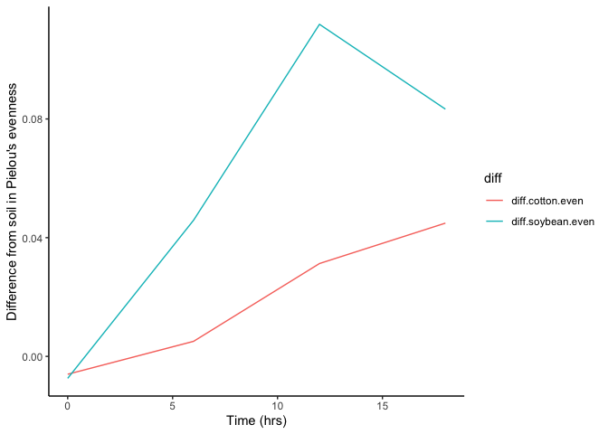

# Question 1: Read dataset

``` r
# Clear memory
rm(list=ls(all = TRUE))

# Loading tidyverse library
library(tidyverse)
```

    ## ── Attaching core tidyverse packages ──────────────────────── tidyverse 2.0.0 ──
    ## ✔ dplyr     1.1.4     ✔ readr     2.1.5
    ## ✔ forcats   1.0.0     ✔ stringr   1.5.0
    ## ✔ ggplot2   3.5.1     ✔ tibble    3.2.1
    ## ✔ lubridate 1.9.3     ✔ tidyr     1.3.1
    ## ✔ purrr     1.0.2     
    ## ── Conflicts ────────────────────────────────────────── tidyverse_conflicts() ──
    ## ✖ dplyr::filter() masks stats::filter()
    ## ✖ dplyr::lag()    masks stats::lag()
    ## ℹ Use the conflicted package (<http://conflicted.r-lib.org/>) to force all conflicts to become errors

``` r
diversity <- read.csv("DiversityData.csv" , na.strings = "na")
meta <- read.csv("Metadata.csv", na.strings = "na")
```

# Question 2: Joining datasets by column Code

``` r
alpha <- (left_join(meta, diversity, by = "Code")) # adding the richness data to the metadata based on on the common column of sampleID
```

# Question 3: Calculate Pielou’s evenness index:

``` r
# We are creating a new column that will be the result of shannon divided by log of richness
alpha_even <- mutate(alpha, logRich = shannon/log(richness))
```

# Question 4: Using the summarise() function to calculate the mean and standard error evenness grouped by crop over time.

``` r
alpha_average <- alpha_even %>% # We start with this dataset
  select(Code, Crop, Time_Point, Replicate, Water_Imbibed, shannon, invsimpson, simpson, richness) %>%
  group_by(Crop, Time_Point) %>% # grouping by Crop and Tmepoint to later calculate summary stats by group
  mutate(logRich = shannon/log(richness)) %>% # creating a new column of the log richness
  summarise(Mean.even = mean(logRich), # calculating the mean evennes, stdeviation, and standard error
            n = n(), # output of the sample size per group
            sd.dev = sd(logRich)) %>% # calculating the standard deviation of logRich
  mutate(std.err = sd.dev/sqrt(n)) # calculating the standard error which will be stored in the column std.err
```

    ## `summarise()` has grouped output by 'Crop'. You can override using the
    ## `.groups` argument.

# Question 5: Calculate the difference between the soybean column, the soil column, and the difference between the cotton column and the soil column

``` r
alpha_average2 <- alpha_average %>% # We start with this dataset
  select(Time_Point, Crop, Mean.even) %>%
  pivot_wider(names_from = Crop, values_from = Mean.even) %>% # pivot to wide format by taking the names from the Crop column and the values from the mean.even column
  mutate(diff.cotton.even = Soil - Cotton) %>% # calculate the difference between Soil and Cotton
  mutate(diff.soybean.even = Soil - Soybean)  # calculate the difference between Soil and Soybean
```

# Questio 6: Connecting it to plots

``` r
alpha_average2 %>%
  select(Time_Point, diff.cotton.even, diff.soybean.even) %>%
  pivot_longer(c(diff.cotton.even, diff.soybean.even), names_to = "diff") %>%
  ggplot(aes(x = Time_Point, y = value, color = diff)) + # Plot it 
  geom_line() +
  theme_classic() +
  xlab("Time (hrs)") +
  ylab("Difference from soil in Pielou's evenness")
```

<!-- -->

[Link to GitHub](https://github.com/AnetFilipova/Reproducible_Data)
